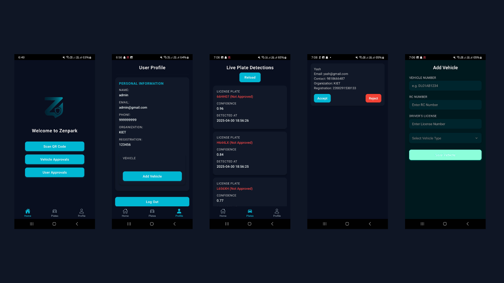

# Zenpark - Smart Parking Management System 🚗🅿️

  
<!-- 🔄 Replace 'assets/preview.png' with the actual path or a hosted image/GIF URL -->

Zenpark is an AI-driven parking management system designed to automate vehicle entry and exit logging using real-time number plate recognition. It leverages YOLO (You Only Look Once) and OCR to detect and verify vehicle plates, making parking operations smarter and more efficient.

---

## 🚀 Features

- 🔍 **YOLO + OCR**: Real-time vehicle number plate detection and verification.
- 📲 **React Native App**: User-friendly cross-platform frontend using Expo.
- ⚡ **FastAPI Backend**: High-performance API with WebSocket support.
- 👥 **User Management**: Register, fetch, and approve users seamlessly.
- 🧠 **AI Integration**: Continuous video feed analysis using YOLO + OCR.
- 🛢 **MongoDB + MySQL**: MongoDB for user profiles, MySQL for vehicle logs.
- 🔄 **Real-Time Updates**: WebSocket communication for live detection events.

---

## 🛠 Tech Stack

| Layer       | Technology                     |
|-------------|--------------------------------|
| Frontend    | React Native (Expo)            |
| Backend     | FastAPI                        |
| AI/ML       | YOLO (v5+), Tesseract OCR      |
| Realtime    | WebSocket                      |
| Database    | MongoDB (users), MySQL (logs)  |

---

## 📦 Installation

### 1. Clone the Repository
```bash
git clone https://github.com/your-username/zenpark.git
cd zenpark
